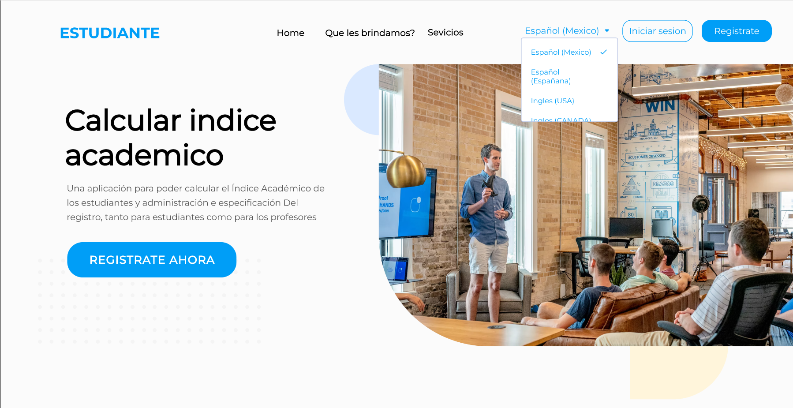
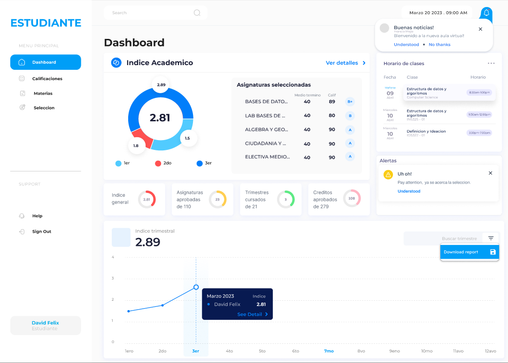
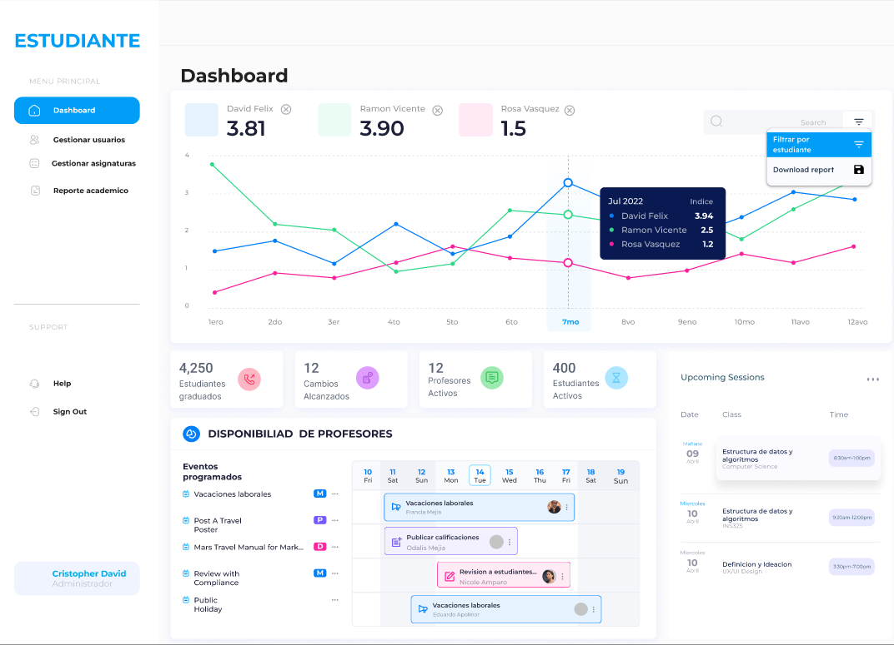
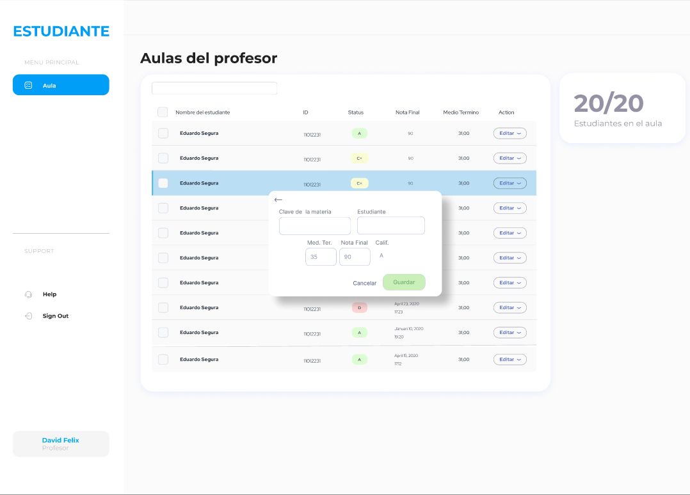

<p align="center">
  
</p>

<h1 align="center">Sistema de Gestión Académica</h1>

<p align="center">
  
  
  
  
  
  
</p>

<p align="center">
  <strong>Aplicación full-stack para la gestión académico-administrativa universitaria.</strong><br>
  CRUD de entidades, ranking académico, calificaciones automáticas y autenticación JWT.
</p>

---

## Tabla de Contenidos

- [Acerca del Proyecto](#acerca-del-proyecto)
- [Demo](#demo)
- [Capturas de Pantalla](#capturas-de-pantalla)
- [Stack Tecnológico](#stack-tecnológico)
- [Arquitectura](#arquitectura)
- [Prerrequisitos](#prerrequisitos)
- [Instalación](#instalación)
- [Documentación de la API](#documentación-de-la-api)
- [Características](#características)
- [Autores y Agradecimientos](#autores-y-agradecimientos)
- [Licencia](#licencia)

---

## Acerca del Proyecto

> **Nota:** Este es un proyecto académico universitario desarrollado como parte de un curso de aseguramiento de calidad. **No está pensado para producción ni recibe mantenimiento activo.**

La interfaz de usuario fue diseñada originalmente en **Figma** y transpilada automáticamente a código React mediante una herramienta de exportación (Figma-to-React). Por esta razón, el código frontend conserva estilos hardcodeados, nombres de clases autogenerados y estructuras propias del proceso de conversión. Se mantiene intacto para preservar el registro histórico del desarrollo.

- [Ver prototipo en Figma](https://www.figma.com/proto/Vongd5Dhhzp8knzGE1Zihn/Proyecto-de-aseguramiento-de-calidad?node-id=170-107253&t=EKE9zNhzpK6rscwR-1)

---

## Demo

Puedes ver una demostración completa del sistema en el siguiente video:

[Ver demo en YouTube](https://youtu.be/5RSPmlTVYOA?si=jVZeF6kMellaCP8J)

---

## Capturas de Pantalla

<table>
  <tr>
    <td align="center">
      
      <br>
      <sub>Pantalla de Inicio</sub>
    </td>
    <td align="center">
      
      <br>
      <sub>Vista del Estudiante</sub>
    </td>
  </tr>
  <tr>
    <td align="center">
      
      <br>
      <sub>Panel Administrativo</sub>
    </td>
    <td align="center">
      
      <br>
      <sub>Vista del Profesor</sub>
    </td>
  </tr>
</table>

---

## Stack Tecnológico

### Backend
| Tecnología | Versión | Propósito |
|------------|---------|-----------|
| [Django](https://www.djangoproject.com/) | 4.1.x | Framework web principal |
| [Django REST Framework](https://www.django-rest-framework.org/) | 3.14.x | Construcción de la API REST |
| [Simple JWT](https://django-rest-framework-simplejwt.readthedocs.io/) | 5.2.x | Autenticación basada en tokens JWT |
| [drf-spectacular](https://drf-spectacular.readthedocs.io/) | 0.26.x | Documentación OpenAPI/Swagger auto-generada |
| [django-cors-headers](https://github.com/adamchainz/django-cors-headers) | 3.14.x | Manejo de CORS para el frontend |
| [django-environ](https://django-environ.readthedocs.io/) | 0.10.x | Gestión de variables de entorno |

### Frontend
| Tecnología | Versión | Propósito |
|------------|---------|-----------|
| [React](https://react.dev/) | 18.2.x | Biblioteca de UI |
| [React Router](https://reactrouter.com/) | 6.2.x | Enrutamiento del SPA |
| [React Bootstrap](https://react-bootstrap.github.io/) | 2.7.x | Componentes de UI estilizados |
| [Axios](https://axios-http.com/) | 1.3.x | Cliente HTTP |
| [Chart.js](https://www.chartjs.org/) | 4.2.x | Visualización de datos y reportes |
| [@react-pdf/renderer](https://react-pdf.org/) | 3.1.x | Generación de reportes en PDF |

---

## Arquitectura

```text
SistemaGestionAcademica/
├── backend/                  # API REST con Django
│   └── app/
│       ├── app/              # Configuración principal y URLs
│       ├── student/          # Módulo de estudiantes
│       ├── professor/        # Módulo de profesores
│       ├── academic_cycle/   # Ciclos académicos
│       └── subject_cycle/    # Asignaturas por ciclo
│   └── requirements.txt
├── frontend/                 # Aplicación SPA con React
│   ├── public/               # Assets estáticos (íconos, imágenes)
│   └── src/
│       └── pages/            # Vistas principales
└── assets/                   # Recursos para documentación
    ├── logo.svg
    ├── landing.png
    ├── admin.png
    ├── profesor.png
    └── estudiante.png
```

---

## Prerrequisitos

Asegúrate de tener instalado en tu sistema:

- **Python** 3.10+
- **Node.js** 16+ (incluye npm)
- **Git**

---

## Instalación

Sigue los pasos a continuación para ejecutar el proyecto de forma local.

### 1. Clonar el repositorio

```bash
git clone https://github.com/tu_usuario/SistemaGestionAcademica.git
cd SistemaGestionAcademica
```

### 2. Configurar el Backend

```bash
# Crear entorno virtual
python -m venv env

# Activar entorno (macOS/Linux)
source env/bin/activate
# Activar entorno (Windows)
# env\Scripts\activate

# Instalar dependencias
pip install -r requirements.txt

# Aplicar migraciones de la base de datos (SQLite por defecto)
cd backend/app
python manage.py migrate
```

### 3. Configurar el Frontend

En una **nueva terminal**, desde el directorio raíz del proyecto:

```bash
cd frontend
npm install
```

### 4. Ejecutar el proyecto

Levanta ambos servidores (backend y frontend) en terminales separadas:

**Terminal 1 — Backend:**
```bash
cd backend/app
python manage.py runserver
```
Accede al panel de administración en: `http://127.0.0.1:8000/admin/`

**Terminal 2 — Frontend:**
```bash
cd frontend
npm start
```
La aplicación estará disponible en: `http://localhost:3000/`

---

## Documentación de la API

Gracias a **drf-spectacular**, la API cuenta con documentación interactiva auto-generada en formato OpenAPI/Swagger.

Una vez el servidor backend esté corriendo, puedes acceder a:

| Recurso | URL |
|---------|-----|
| **Esquema OpenAPI (JSON)** | `http://127.0.0.1:8000/api/v1/schema/` |
| **Swagger UI** | `http://127.0.0.1:8000/api/v1/schema/swagger-ui/` |

### Endpoints principales

- `POST /api/v1/students/login/`
- `GET  /api/v1/students/profile/`
- `GET  /api/v1/students/profile/grades/`
- `GET  /api/v1/students/profile/academic-record/`
- `POST /api/v1/students/reset-password/`
- `POST /api/v1/professor/login/`
- `GET  /api/v1/professor/profile/`
- `GET  /api/v1/professor/subjects/`
- `GET  /api/v1/professor/subjects/{id}/students/`
- `POST /api/v1/professor/subjects/{id}/grade/`
- `PUT  /api/v1/professor/subjects/{id}/grade/review`
- `GET  /api/v1/academic-cycles/`
- `GET  /api/v1/subject-cycles/`

---

## Características

- [x] **Gestión de Estudiantes**: Registro de ID, nombre y carrera.
- [x] **Gestión de Asignaturas**: Clave, nombre, créditos y profesores asignados.
- [x] **Gestión de Calificaciones**: Registro numérico con conversión automática a letras.
  - **A**: 90 - 100
  - **B**: 80 - 89
  - **C**: 70 - 79
  - **D**: 60 - 69
  - **F**: ≤ 59
- [x] **Ranking Académico**: Reporte ordenado por índice académico (mayor a menor).
- [x] **Autenticación JWT**: Login seguro para estudiantes y profesores.
- [x] **Panel de Administración Django**: Gestión de datos vía `/admin/`.
- [x] **Documentación API Interactiva**: Swagger UI auto-generado.
- [x] **Reportes en PDF**: Generación de documentos académicos.

---

## Autores y Agradecimientos

**Colaboradores:**
- Axel Castillo
- Manuel Mancebo
- Rayfel Ogando
- Rómulo Pérez

**Supervisor:**
- Ing. Omar Núñez

Agradecimientos a la institución universitaria y al cuerpo docente por el acompañamiento durante el desarrollo de este proyecto académico.

---

## Licencia

Distribuido bajo la Licencia MIT. Consulta el archivo [`LICENSE`](LICENSE) para más información.
